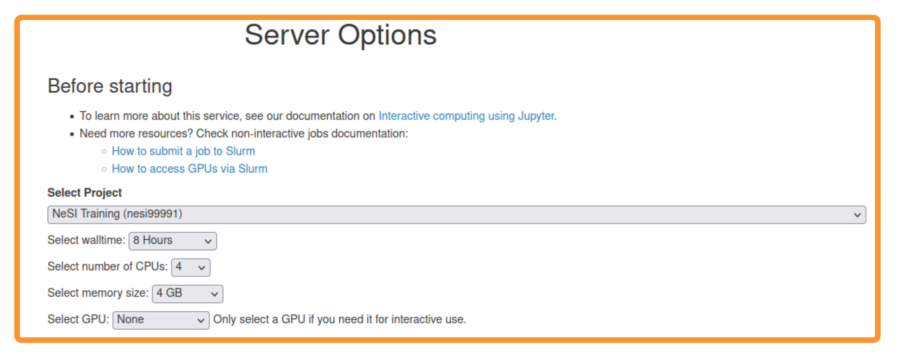

# Workshop Setup

During this workshop we will be running the material on the NeSI platform, using the [Jupyter-on-NeSI](https://jupyter.nesi.org.nz) service.
This section will walk you through the steps to start a session and checking that the workshop material is ready for you.

## Connect to Jupyter on NeSI

1. Open [https://jupyter.nesi.org.nz](https://jupyter.nesi.org.nz){:target="_blank"} in your web browser.
2. Enter your NeSI username, HPC password and 6 digit second factor token (as set on [MyNeSI](https://my.nesi.org.nz/account/hpc-account)).<br>
   
3. Choose server options as below.<br>
   

    !!! warning

        Make sure to choose the correct project code `nesi99991`, number of CPUs **2**, memory **4GB** and GPU **None** prior to pressing the button {width="60" .vertical}.

4. Start a terminal session from the JupyterLab launcher.<br>
   {width="500"}
5. And *voilà*! You are ready to go 😄.

!!! note

    All commands listed in the workshop will be entered in this terminal.

## Workshop folder

This workshop involves creating a few files.
You should have a folder named with your NeSI login under `/nesi/project/nesi99991/introhpc2403/`.

Just in case, let's make sure it exists using:

```bash
mkdir -p /nesi/project/nesi99991/introhpc2403/$USER
```

And then move to this folder:

```bash
cd /nesi/project/nesi99991/introhpc2403/$USER
```

In this workshop, we will use the `nano` editor to edit files.
Note that you can also use the JupyterLab file browser and editor instead.

---

In the [next section](install.md), we will explore multiple ways to access and install deep learning toolboxes.
